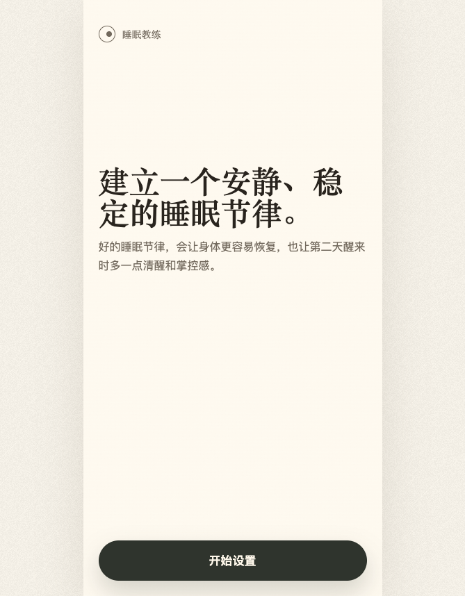
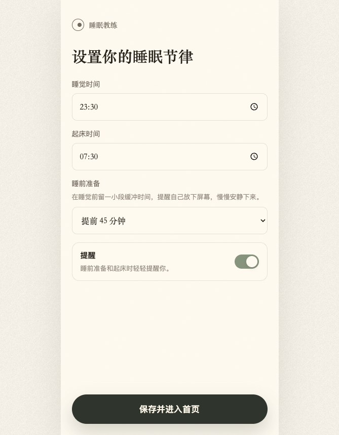
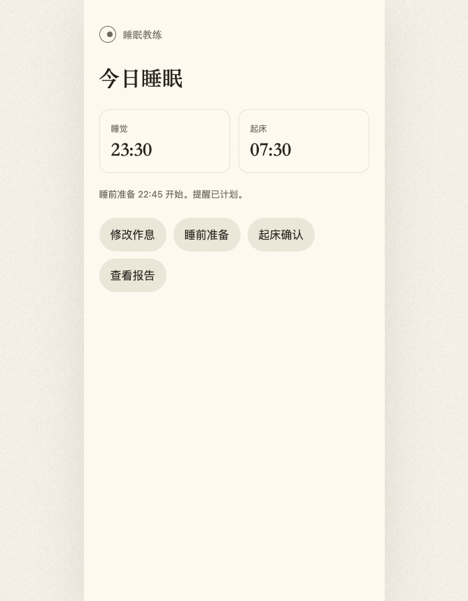
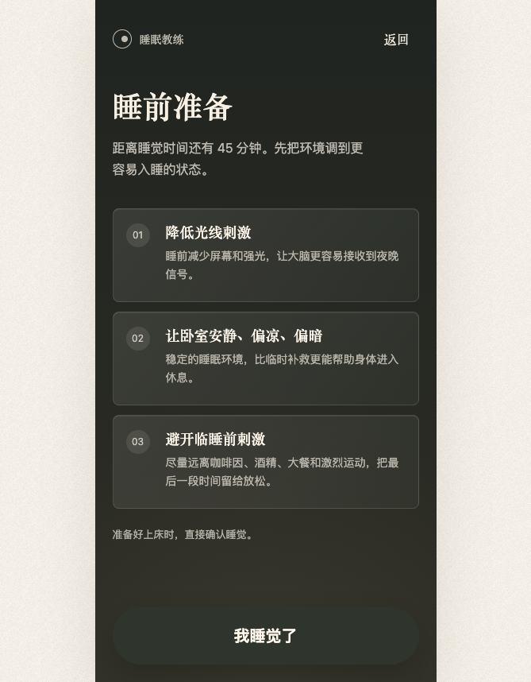
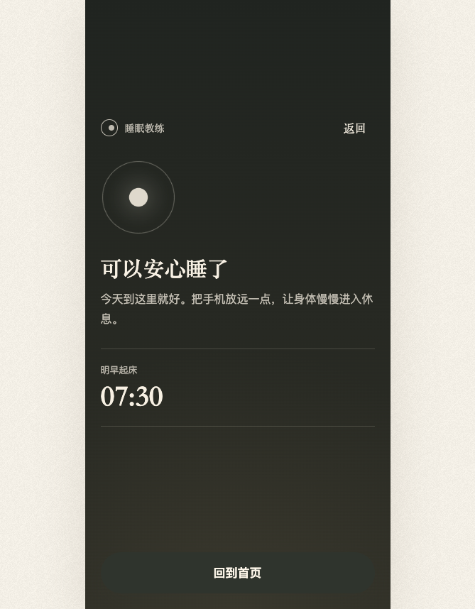
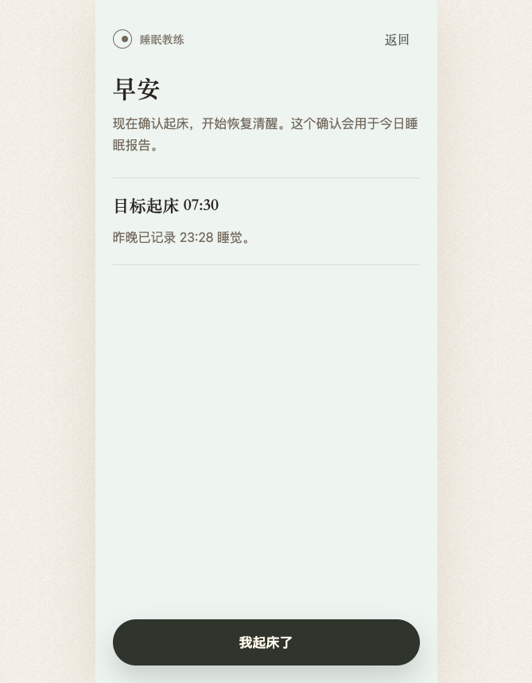
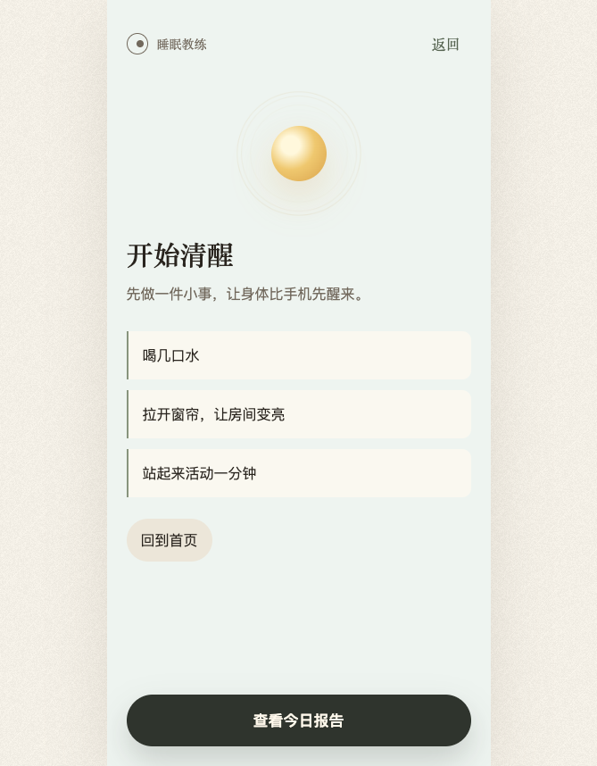
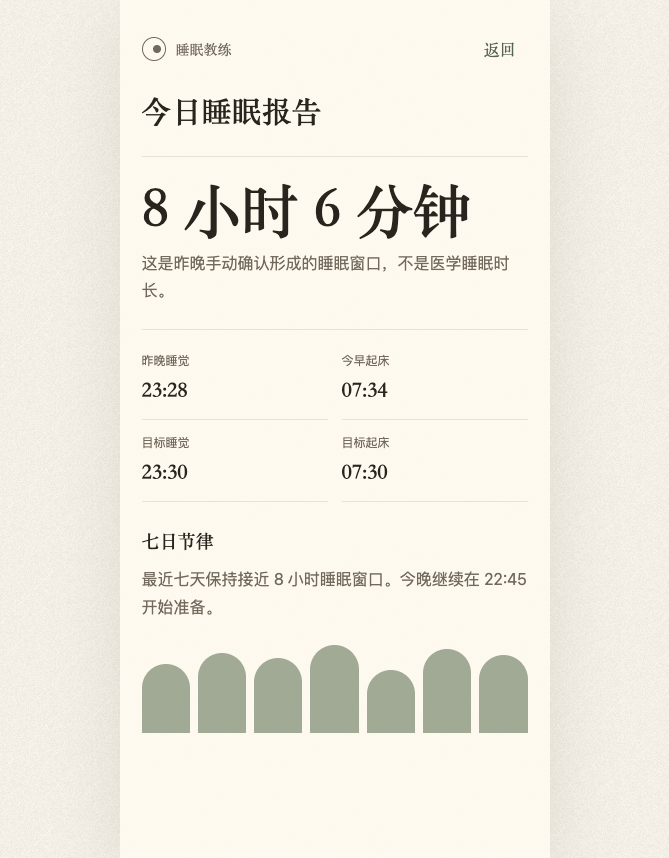

# 设计文档：睡眠教练 V1.1

## 1. 设计结论

V1.1 使用 **极简日式/北欧** 方向：暖灰、米白、克制排版、柔和触感、低噪声动效。

设计目标不是“信息丰富”，而是让用户在两个关键时刻有明确感受：

- 晚上：平静、安宁、结束。
- 早上：明亮、清醒、唤起。

当前 Web 原型已经作为高保真设计基准。无需先重新产出单独 UI 高保真图，直接使用原型状态截图作为设计交付图：

- 截图目录：`docs/prototypes/sleep-coach-web-v1-1/screenshots/`
- 原型地址：`http://localhost:5174`

## 2. 设计原则

### 2.1 少解释，多引导

界面不应该用大量文字告诉用户“这里可以做什么”。用户进入页面时，应自然知道下一步。

例如：

- 睡前准备页不需要「我开始准备了」。
- 睡觉确认后不强调「已记录」。
- 起床确认后不说记录结果，而是让用户做一件小事。

### 2.2 不做任务清单

睡前准备不是打卡任务。tips 是建议，不是必须完成的 checklist。

视觉上避免：

- 多个 checkbox。
- 完成进度条。
- 任务完成率。
- 连续打卡压力。

### 2.3 场景色彩必须有情绪差异

- 白天/首页：暖米白，留白多，安静。
- 睡前：深暖灰绿，低亮度，减少刺激。
- 起床：浅雾绿色和柔和晨光，明亮但不刺眼。

### 2.4 动效服务情绪，不服务炫技

动效只出现在两个确认后的关键状态：

- 「我睡觉了」后：呼吸圆收束。
- 「我起床了」后：太阳和光圈展开。

动效应该短、轻、可忽略；不能影响主操作。

## 3. 高保真状态图

### 3.1 首次进入

设计要点：

- 标题是第一视觉焦点。
- 品牌只作为安静存在，不抢主标题。
- 底部主按钮固定，降低下一步成本。
- 不展示版本号、英文 kicker 或功能介绍。

### 3.2 设置作息

设计要点：

- 表单字段少，只保留作息所需信息。
- 提醒开关是定制化组件，不使用原生 checkbox 视觉。
- “睡前准备”有一句轻提示，解释这个时间的意义。
- 按钮文案直接：「保存并进入首页」或「保存修改」。

### 3.3 今日睡眠首页

设计要点：

- 睡觉/起床时间以并列时间卡呈现。
- 操作入口使用柔和胶囊按钮。
- 首页不使用大段说明文案。
- 入口优先级：修改作息、睡前准备、起床确认、查看报告。

### 3.4 睡前准备

设计要点：

- 深色背景降低刺激。
- 页面首先给出科学助眠 tips。
- tips 使用编号和轻卡片，不使用 checkbox。
- 「我睡觉了」按钮更大，适合睡前低注意力状态。

### 3.5 睡觉确认后

设计要点：

- 页面中心出现收束的呼吸圆。
- 文案从“记录完成”改成“可以安心睡了”。
- 时间信息只保留“明早起床”，减少认知负担。
- 允许返回首页，但不鼓励继续探索 App。

### 3.6 起床确认

设计要点：

- 主标题「早安」。
- 主按钮「我起床了」固定底部。
- 说明文案短，不解释后台记录机制。

### 3.7 起床确认后

设计要点：

- 晨光圆形动效建立唤起感。
- 三个行动提示是启动身体，不是任务清单。
- 「查看今日报告」是主按钮，但不抢走清晨状态。

### 3.8 今日报告

设计要点：

- 报告第一视觉是睡眠窗口。
- 明确说明这不是医学睡眠时长。
- 四个指标用细分割线和克制排版。
- 七日趋势用抽象柱形，不做复杂图表。

## 4. 视觉系统

### 4.1 色彩

核心色彩方向：

| 用途 | 建议值 | 说明 |
| --- | --- | --- |
| 米白背景 | `#fffaf0` | 主背景，温暖但不偏黄 |
| 页面底色 | `#f3efe6` | 外层背景和纸感 |
| 主文字 | `#29241e` | 深暖黑 |
| 次级文字 | `#72695d` | 暖灰 |
| 柔和分割 | `rgba(114, 105, 93, 0.16)` | 表单和报告分割 |
| 鼠尾草绿 | `#87947d` | 趋势和开关 |
| 深夜背景 | `#252925` | 睡前场景 |
| 晨间背景 | `#eef4f0` | 起床场景 |
| 主按钮 | `#2f342d` | 深绿黑 |

限制：

- 不使用大面积紫色、蓝色渐变。
- 不使用强商业化高饱和色。
- 蓝色只允许出现在系统焦点或浏览器标注中，不是产品色。

### 4.2 字体

原型字体方向：

- 标题：serif，接近宋体 / Georgia 气质。
- 正文和按钮：system sans，保证可读性。

iOS 实现建议：

- 大标题：`serif` 气质可用自定义字体或系统 serif fallback；如果实现成本高，使用系统字体但要保持字重和留白。
- 正文：`Font.body` / `Font.callout`，配合 Dynamic Type。
- 按钮：系统无衬线，半粗。

### 4.3 圆角

- 主要卡片：8-14px 对应 SwiftUI `cornerRadius(8...14)`。
- 胶囊按钮：`Capsule()`。
- 页面不使用卡片嵌套卡片。
- 报告指标优先用分割线，不滥用卡片。

### 4.4 空间

移动端基准：

- 页面横向 padding：22pt。
- 顶部导航高度：约 42pt。
- 主按钮底部距离：22pt。
- 主按钮高度：58pt。
- 睡觉确认按钮高度：72pt。
- 表单字段高度：54pt。
- 页面底部预留：至少 112pt，避免 fixed 主按钮遮挡内容。

## 5. 组件规格

### 5.1 顶部品牌栏

组成：

- 圆形品牌 mark。
- 文案：睡眠教练。
- 可选返回按钮。

规则：

- 返回按钮只在二级页面出现。
- 品牌不作为主标题，不抢页面焦点。

### 5.2 主按钮

用途：

- 开始设置。
- 保存并进入首页。
- 我睡觉了。
- 我起床了。
- 查看今日报告。

规则：

- 固定底部。
- 深绿黑背景。
- 白色文字。
- 睡前「我睡觉了」使用更大高度。

### 5.3 次级按钮

用途：

- 修改作息。
- 睡前准备。
- 起床确认。
- 查看报告。
- 回到首页。

规则：

- 胶囊形。
- 米灰背景。
- 不使用描边强调。

### 5.4 表单输入

字段：

- 时间选择。
- 睡前准备提前量。
- 提醒开关。

规则：

- 不使用蓝色原生 checkbox。
- 提醒开关需要有标题和解释。
- 字段间距稳定，不因文案变化跳动。

### 5.5 睡前 tips

规则：

- 每条包含编号、标题、说明。
- 不出现勾选态。
- tips 是建议，不是必须完成。
- 每条高度稳定，避免按钮被挤出首屏。

## 6. 动效规格

### 6.1 页面进入

默认页面进入：

- 透明度 0 → 1。
- Y 轴 8pt → 0。
- 时长约 280ms。

### 6.2 睡觉确认动效

触发：点击「我睡觉了」。

效果：

- 圆环从稍大状态收束。
- 中心圆轻微缩小并稳定。
- 内容轻微上浮出现。

情绪目标：

- 平静。
- 安宁。
- 今天结束。

建议参数：

- 圆环时长：约 2200ms。
- 内容入场：约 720ms。
- 缓动：ease-out。

### 6.3 起床确认动效

触发：点击「我起床了」。

效果：

- 太阳从下方升起到中心。
- 2-3 层光圈向外扩散并淡出。
- 内容轻微上浮出现。

情绪目标：

- 清醒。
- 明亮。
- 身体启动。

建议参数：

- 太阳入场：约 980ms。
- 光圈扩散：约 1400ms。

### 6.4 减少动态效果

当系统开启 Reduce Motion：

- 禁用或大幅降低确认动效。
- 保留页面文案和状态变化。
- 不让用户依赖动效理解结果。

## 7. 文案规范

### 7.1 禁止

- 禁止显示英文 kicker，如 `Today`、`Wind down`、`First setup`。
- 禁止在用户核心体验中强调“已记录”。
- 禁止用大量说明解释功能如何使用。
- 禁止医学化表达，如“睡眠质量评分”“深睡不足”。

### 7.2 推荐

- 睡前：短句、慢、轻。
- 早晨：行动动词、明亮、低阻力。
- 报告：克制、清晰、边界明确。

## 8. 无障碍与适配

- 所有主按钮点击区域不小于 44pt。
- 支持 Dynamic Type；大字号下底部按钮仍应可见。
- 深色睡前页需要保证正文对比度。
- 动效尊重 Reduce Motion。
- 品牌图形和装饰动效应标记为无障碍隐藏。
- 截图状态至少验证 669x858 近似移动视口；iOS 实现还需验证 iPhone SE 类小屏和大字号。

## 9. Native 实现注意

- 不要只复用现有基础 SwiftUI 组件导致视觉退回第一版。
- 可以复用现有设计系统文件，但需要按本文档重设 token 和组件细节。
- 睡觉确认后、起床确认后需要独立状态页或状态视图，不能只是 toast。
- 报告页不要做复杂仪表盘；保持安静和可读。

