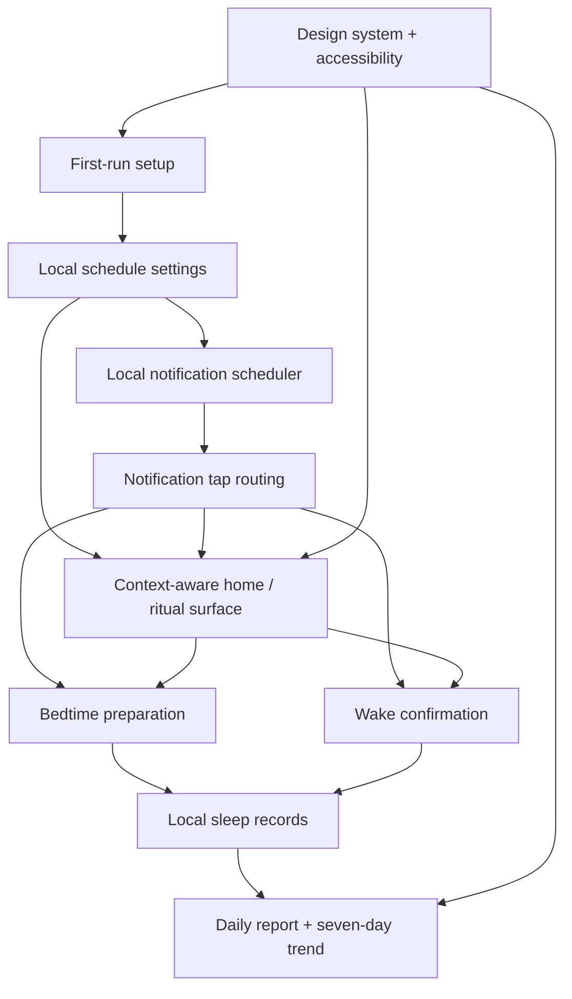

# feat: Build sleep coach iOS MVP

## Overview

Build the first version of a native iOS sleep coach app from an empty repository. The app lets the user configure a bedtime, wake-up time, and bedtime preparation lead time; sends local reminders; supports a low-friction bedtime and wake-up ritual; stores local manual sleep records; and presents a daily report plus seven-day trend in a minimalist Japanese/Scandinavian visual style.

The plan intentionally avoids HealthKit, WeatherKit, accounts, cloud sync, paid features, long-image sharing, widgets, and broad habit tracking, matching the MVP boundary in the origin document.

## Problem Frame

The user wants a simple but highly designed iOS app that helps turn sleep intent into behavior: prepare before bed, confirm wake-up, and see sleep consistency reflected in an elegant report. The app should be useful without measured sleep data, so all reporting must be framed as schedule-based or estimate-based signals rather than clinical sleep tracking (see origin: `docs/brainstorms/2026-06-04-energy-management-ios-app-requirements.md`).

## Requirements Trace

- R1-R6. First-run schedule setup, editable bedtime/wake-up/prep lead time, home schedule summary, and low-noise notification-permission prompt.
- R7-R10. Bedtime preparation reminder, concrete wind-down suggestions, optional guidance, and bedtime confirmation framed as a manual ritual signal.
- R11-R15. Wake-up confirmation around the target wake time, prominent one-tap confirmation, natural early waking support, missed-confirmation handling, and wake-up prompts.
- R16-R20. Daily report, estimated sleep opportunity, wake-up punctuality, seven-day trend, polished visual hierarchy, and explicit estimate-based data language.
- R21-R25. Minimalist Japanese/Scandinavian visual direction, warm gray / warm white palette, nighttime treatment, accessibility, key states, and no broad productivity tracker behavior.
- R26-R27. Manual local data only for MVP, with future room for HealthKit but no HealthKit dependency now.
- Success criteria. Short setup, useful bedtime reminder, one-action wake confirmation, rewarding daily report, visible weekly trend, graceful imperfect states, and focused MVP scope.

## Scope Boundaries

- No HealthKit, WeatherKit, location permission, account system, cloud sync, social sharing, StoreKit, paid feature gating, export, monthly/yearly reports, widgets, detailed sleep-stage analysis, sleep score model, medical claims, broad productivity tracking, or mandatory bedtime checklist.
- No claim that the app measures actual sleep duration. The MVP reports estimated sleep opportunity and schedule consistency.
- No implementation of Apple Watch, multi-device behavior, or server-side services.
- No multi-language localization in MVP. The first version should ship with Simplified Chinese user-facing copy, while keeping strings structured so future localization is not painful.

## Context & Research

### Relevant Code and Patterns

- The repository currently has no iOS project, app source, tests, README, or project-specific `AGENTS.md`. Planning starts from a greenfield native iOS app.
- Existing product sources:
  - `docs/brainstorms/2026-06-04-energy-management-ios-app-requirements.md`
  - `docs/brainstorms/sleep-ritual-app-requirements.md`
- No `docs/solutions/` institutional learnings were present.

### External References

- Apple UserNotifications documentation for requesting authorization and scheduling local notifications:
  - https://developer.apple.com/documentation/usernotifications
  - https://developer.apple.com/documentation/usernotifications/scheduling-a-notification-locally-from-your-app
- Apple SwiftData documentation for local model persistence:
  - https://developer.apple.com/documentation/swiftdata
- Apple SwiftUI accessibility documentation for labels, Dynamic Type, and reduced-motion-aware UI:
  - https://developer.apple.com/documentation/swiftui/accessibility-fundamentals
- Apple XCTest documentation for unit and UI test coverage:
  - https://developer.apple.com/documentation/xctest

### Planning Context

- External research is warranted because there are no local implementation patterns and the app touches notification permission, local persistence, accessibility, and personal routine data.
- The plan uses Apple platform primitives only. This keeps the MVP native, private, and aligned with the requirement to avoid external accounts or services.

## Key Technical Decisions

- Create a native SwiftUI iOS app with app, unit test, and UI test targets: the repo is empty, so the first unit must establish the Xcode project and test scaffolding before feature work.
- Use local persistence for settings and sleep records: the MVP stores manual schedule and confirmation data on device only, matching R26 and avoiding cloud or account scope.
- Use UserNotifications for bedtime preparation and wake reminders: reminders should reschedule whenever bedtime, wake time, or prep lead time changes.
- Route notification taps intentionally: bedtime-preparation notification taps should open the bedtime preparation surface; wake notification taps should open wake confirmation when the window is active; stale taps should land on the context-aware home state.
- Resolve wake confirmation timing as a planning decision: the confirmation window opens 30 minutes before target wake time and closes 60 minutes after target wake time. Missing the window marks the local day as missed or estimated in reports.
- Do not implement snooze or repeated wake alarms in MVP: this app is a sleep ritual coach, not an alarm clock replacement.
- Use a small domain/service layer for date calculations and report summaries: this keeps time-window logic testable outside SwiftUI views.
- Treat local schedule times as wall-clock times: future reminders follow the device's current local time zone, while sleep records store the schedule snapshot and time-zone context used for that day so historical reports do not drift.
- Treat the visual system as product-critical from the first UI unit: use lightweight placeholder design tokens early, then finalize brand assets, components, accessibility, and reduced-motion behavior in the visual polish unit.

## Open Questions

### Resolved During Planning

- Notification repeat cadence: use one daily bedtime-preparation notification and one daily wake reminder; no snooze or repeated reminder loop in MVP.
- Wake confirmation window: allow confirmation from 30 minutes before target wake time through 60 minutes after target wake time.
- Missed confirmations: represent missed wake confirmation explicitly in the local record and report UI as missed or estimated rather than silently assuming success.
- Post-window wake behavior: if the user opens the app after the wake confirmation window has closed, show a low-noise "missed confirmation" state and report the day as missed or estimated; do not allow a late tap to count as an on-time wake confirmation.
- Sleep report terminology: use "estimated sleep opportunity" and "schedule signal" language, not actual sleep duration or measured sleep quality.
- Data migration policy: during active MVP development, destructive local data resets are acceptable when schemas churn; after a usable build is shared, prefer SwiftData lightweight migration and avoid silent data loss.
- Language policy: MVP user-facing copy is Simplified Chinese, with strings kept in a localization-friendly structure for future translation.

### Deferred to Implementation

- Exact Xcode project settings and deployment target: choose the current practical iOS target during project creation, while preserving SwiftUI, SwiftData, and UserNotifications support.
- Exact model property names and persistence APIs: finalize while creating the SwiftData model layer.
- Exact visual measurements, typography choices, animation durations, and palette tokens: finalize in the design-system implementation while staying within the Japanese/Scandinavian warm gray / warm white direction.
- Exact simulator matrix: choose available local simulators during implementation.

## High-Level Technical Design

> *This illustrates the intended approach and is directional guidance for review, not implementation specification. The implementing agent should treat it as context, not code to reproduce.*



## Implementation Units

- [ ] **Unit 1: App scaffold and test targets**

**Goal:** Generate the native iOS project foundation, app target, unit test target, UI test target, initial app shell, basic README, and lightweight design-token placeholders.

**Requirements:** R1-R27 foundation, all success criteria enablement.

**Dependencies:** None.

**Files:**
- Generate: `EnergyManagement.xcodeproj/project.pbxproj`
- Create: `EnergyManagement/EnergyManagementApp.swift`
- Create: `EnergyManagement/ContentView.swift`
- Create: `EnergyManagement/DesignSystem/ColorTokens.swift`
- Create: `EnergyManagement/DesignSystem/TypographyTokens.swift`
- Create: `EnergyManagement/DesignSystem/SpacingTokens.swift`
- Create: `README.md`
- Create: `EnergyManagementTests/EnergyManagementTests.swift`
- Create: `EnergyManagementUITests/EnergyManagementUITests.swift`

**Approach:**
- Create the SwiftUI app project through Xcode's project template or an available Xcode project-generation tool. Do not hand-write `.pbxproj`; treat it as a generated project artifact.
- Keep the initial app shell minimal: route into onboarding when settings are absent and into the main home surface when settings exist.
- Establish folder group conventions for `Models`, `Services`, `Views`, `DesignSystem`, and `Resources` without over-abstracting before features exist.
- Add lightweight warm white / warm gray color, type, and spacing tokens immediately so later UI units do not hard-code styling and require a visual rewrite.
- Add a short README describing MVP scope, local-only data behavior, excluded integrations, and the current implementation plan.

**Patterns to follow:**
- Apple SwiftUI app lifecycle and XCTest target conventions.

**Test scenarios:**
- Happy path: launching the app with no saved settings shows the first-run setup entry surface.
- Happy path: launching the app test target succeeds without requiring notification, location, HealthKit, account, or network setup.
- Happy path: initial app surfaces can reference design tokens without depending on finalized brand assets.

**Verification:**
- The project opens as a native iOS app with app, unit test, and UI test targets.
- The initial UI has a stable entry point for onboarding and main app routing.
- The README documents MVP scope and privacy boundaries at a basic level.

- [ ] **Unit 2: Local domain model, persistence, and report calculations**

**Goal:** Define local settings and sleep-record concepts, persist them on device, and provide testable calculations for confirmation windows, missed records, estimated sleep opportunity, wake punctuality, and seven-day trends.

**Requirements:** R2-R5, R10-R20, R26-R27.

**Dependencies:** Unit 1.

**Files:**
- Create: `EnergyManagement/Models/SleepSchedule.swift`
- Create: `EnergyManagement/Models/SleepRecord.swift`
- Create: `EnergyManagement/Models/ReportSummary.swift`
- Create: `EnergyManagement/Services/SleepDataStore.swift`
- Create: `EnergyManagement/Services/SleepReportCalculator.swift`
- Create: `EnergyManagement/Services/WakeWindowPolicy.swift`
- Test: `EnergyManagementTests/SleepReportCalculatorTests.swift`
- Test: `EnergyManagementTests/WakeWindowPolicyTests.swift`
- Test: `EnergyManagementTests/SleepDataStoreTests.swift`

**Approach:**
- Store one active schedule and a local-day-indexed set of sleep records.
- Store the schedule snapshot, calendar day, and time-zone context used for each sleep record so historical reports remain stable after schedule edits or travel.
- Represent bedtime confirmation, wake confirmation, missed confirmation, and estimated report states explicitly.
- Use calendar-aware date calculations rather than string-based time math.
- Keep report output separate from persistence models so views can render stable summaries without duplicating calculation rules.
- Apply the migration policy from this plan: destructive resets are acceptable only during active MVP development; after a usable build is shared, prefer lightweight migration and avoid silent data loss.

**Technical design:** Directional data flow:

```text
Schedule + local date + record events
  -> WakeWindowPolicy
  -> SleepRecord status
  -> SleepReportCalculator
  -> DailyReportSummary + SevenDayTrendSummary
```

**Patterns to follow:**
- Apple SwiftData model/persistence guidance.
- Swift unit tests for pure calculation services before UI wiring.

**Test scenarios:**
- Happy path: bedtime 23:00 and wake 07:00 with wake confirmed at 07:10 produces an estimated sleep opportunity near 8 hours and an on-time or slightly-late wake signal.
- Happy path: seven local days with complete records produce average estimated sleep opportunity, wake consistency, and consecutive schedule-meeting days.
- Edge case: wake confirmation 20 minutes before target wake time is accepted as natural early waking.
- Edge case: wake confirmation 70 minutes after target wake time is not treated as an on-time confirmation.
- Edge case: a day with no wake confirmation is represented as missed or estimated and does not silently count as confirmed.
- Edge case: schedule changes mid-week preserve per-day scheduled bedtime/wake values for historical reports.
- Edge case: a device time-zone change affects future wall-clock reminders but does not rewrite historical report calculations.
- Error path: empty record history returns a first-week/data-accumulation report state rather than failing.
- Error path: incompatible development-only local data can be reset deliberately, while shared-build data must not be silently wiped.

**Verification:**
- Core calculations are covered by unit tests and can be exercised without rendering SwiftUI views.
- Report terminology in model/view-model output uses estimate-based wording.

- [ ] **Unit 3: Notification permission, scheduling, and tap routing**

**Goal:** Request notification permission at the right time, schedule local bedtime-preparation and wake reminders, reschedule them when settings change, route notification taps to the right app state, and expose permission state for the UI prompt.

**Requirements:** R1, R3-R8, R11, R14, R24, R26.

**Dependencies:** Unit 2.

**Files:**
- Create: `EnergyManagement/Services/NotificationPermissionService.swift`
- Create: `EnergyManagement/Services/SleepNotificationScheduler.swift`
- Create: `EnergyManagement/Services/NotificationRouteResolver.swift`
- Create: `EnergyManagement/Models/NotificationStatus.swift`
- Create: `EnergyManagement/Models/AppRoute.swift`
- Modify: `EnergyManagement/EnergyManagementApp.swift`
- Test: `EnergyManagementTests/SleepNotificationSchedulerTests.swift`
- Test: `EnergyManagementTests/NotificationPermissionServiceTests.swift`
- Test: `EnergyManagementTests/NotificationRouteResolverTests.swift`

**Approach:**
- Explain notification usage in onboarding before requesting system permission.
- Schedule one bedtime-preparation reminder at bedtime minus lead time and one wake reminder at target wake time.
- Cancel and recreate pending sleep reminders when schedule settings change.
- Surface denied or not-yet-requested permission states so the home/setup UI can show a persistent, low-noise prompt.
- Attach stable notification identifiers or categories so taps can resolve to bedtime preparation, wake confirmation, or home fallback.
- Route stale wake notification taps after the confirmation window to home with a missed-confirmation state instead of pretending the user confirmed on time.
- Keep the scheduler behind a protocol or small abstraction so tests can inspect intended scheduling decisions without relying on real notification delivery.

**Patterns to follow:**
- Apple UserNotifications authorization and local scheduling guidance.

**Test scenarios:**
- Happy path: bedtime 23:00 with 30-minute lead schedules a bedtime-preparation reminder for 22:30.
- Happy path: wake time 07:00 schedules a wake reminder for 07:00.
- Integration: changing wake time from 07:00 to 06:30 replaces the previous pending wake reminder with the new one.
- Integration: tapping a bedtime-preparation notification routes to the bedtime preparation surface.
- Integration: tapping a wake notification during the confirmation window routes to wake confirmation.
- Edge case: tapping a stale wake notification after the wake window routes to home/report state with missed confirmation language.
- Error path: notification permission denied exposes a denied state and does not block schedule setup.
- Error path: scheduler failure or unavailable authorization state is surfaced as a UI-readable status rather than crashing.

**Verification:**
- Reminder scheduling decisions are deterministic in tests.
- The app can continue functioning when notifications are disabled.

- [ ] **Unit 4: Setup and context-aware home**

**Goal:** Implement first-run setup and the context-aware home shell that shows schedule status, permission prompts, current ritual state, and missed-confirmation messaging.

**Requirements:** R1-R6, R11-R14, R21-R26.

**Dependencies:** Units 2 and 3.

**Files:**
- Create: `EnergyManagement/Views/Setup/OnboardingView.swift`
- Create: `EnergyManagement/Views/Setup/ScheduleSetupView.swift`
- Create: `EnergyManagement/Views/Home/HomeView.swift`
- Create: `EnergyManagement/ViewModels/SetupViewModel.swift`
- Create: `EnergyManagement/ViewModels/HomeViewModel.swift`
- Test: `EnergyManagementTests/HomeViewModelTests.swift`
- Test: `EnergyManagementTests/SetupViewModelTests.swift`
- Test: `EnergyManagementUITests/SetupAndHomeUITests.swift`

**Approach:**
- Keep onboarding short: Simplified Chinese value framing, notification explanation, bedtime, wake time, and prep lead time.
- Use localization-friendly string structure even though only Simplified Chinese ships in MVP.
- Make the home view context-aware: show next scheduled state, notification permission prompt, bedtime preparation entry, wake confirmation entry during the window, and missed-confirmation state after the window.
- Use the placeholder design tokens from Unit 1; avoid hard-coded one-off colors, spacing, or typography that would make Unit 7 a rewrite.
- Keep home empty/status states calm and low-noise.

**Patterns to follow:**
- SwiftUI MV-style separation: views render state from view models; services own persistence, notifications, and time calculations.

**Test scenarios:**
- Happy path: first-run setup saves bedtime, wake time, and prep lead time, then routes to the home view.
- Happy path: home shows the current schedule summary and next relevant ritual state.
- Edge case: before the bedtime preparation window, home shows a calm waiting/next-up state.
- Edge case: during the wake window, home exposes the wake confirmation entry point.
- Edge case: after the wake window closes without confirmation, home shows a missed-confirmation state.
- Error path: notification permission denied shows the low-noise permission prompt and still allows app-based ritual flow.
- Integration: setup changes reschedule reminders and update the home schedule summary.

**Verification:**
- A user can complete setup and understand the current schedule and next action from home without external services.
- UI tests cover setup, home routing, notification-denied prompt, and missed-confirmation home state.

- [ ] **Unit 5: Bedtime and wake ritual flows**

**Goal:** Implement the bedtime preparation surface, optional bedtime confirmation, wake confirmation, missed-state handling, and wake-up prompts.

**Requirements:** R7-R15, R21-R26.

**Dependencies:** Units 2, 3, and 4.

**Files:**
- Create: `EnergyManagement/Views/Bedtime/BedtimePreparationView.swift`
- Create: `EnergyManagement/Views/Wake/WakeConfirmationView.swift`
- Create: `EnergyManagement/Views/Wake/WakePromptsView.swift`
- Create: `EnergyManagement/ViewModels/BedtimeViewModel.swift`
- Create: `EnergyManagement/ViewModels/WakeViewModel.swift`
- Test: `EnergyManagementTests/BedtimeViewModelTests.swift`
- Test: `EnergyManagementTests/WakeViewModelTests.swift`
- Test: `EnergyManagementUITests/RitualFlowUITests.swift`

**Approach:**
- Present three to five concrete, low-friction bedtime suggestions as guidance, not a mandatory checklist.
- Use optional bedtime confirmation as a ritual event, not as measured actual sleep time.
- Use a single prominent wake confirmation action and then show two or three practical wake-up prompts.
- Enforce the 30-minutes-before to 60-minutes-after wake confirmation window through view-model state, not just UI copy.
- After the wake window has closed, show missed-confirmation language and route users toward the report/home state rather than allowing an on-time confirmation.
- Use placeholder design tokens and previewable screen states so Unit 7 can polish rather than rebuild.

**Patterns to follow:**
- SwiftUI MV-style separation with testable view models and time-policy services.

**Test scenarios:**
- Happy path: during the bedtime preparation window, bedtime view exposes wind-down guidance.
- Happy path: tapping bedtime confirmation records a bedtime ritual event and shows a calm completion state.
- Happy path: during the wake window, tapping "I'm awake" records wake confirmation and shows wake-up prompts.
- Edge case: 30 minutes before target wake time, wake confirmation is available for natural early waking.
- Edge case: 61 minutes after target wake time, wake confirmation is unavailable and missed language is shown.
- Edge case: bedtime suggestions can render without creating a task-tracking checklist.
- Integration: notification tap routes from Unit 3 open the correct bedtime or wake ritual state.

**Verification:**
- A user can complete the bedtime and wake rituals without external services.
- UI tests cover bedtime guidance, wake confirmation, wake prompts, and post-window missed state.

- [ ] **Unit 6: Daily report and seven-day trend UI**

**Goal:** Render daily report and weekly trend surfaces that communicate estimated sleep opportunity and schedule consistency beautifully without implying measured sleep quality.

**Requirements:** R16-R20, R24, R26-R27, success criteria for rewarding daily report and visible weekly trend.

**Dependencies:** Units 2 and 5.

**Files:**
- Create: `EnergyManagement/Views/Reports/ReportsView.swift`
- Create: `EnergyManagement/Views/Reports/DailyReportCard.swift`
- Create: `EnergyManagement/Views/Reports/SevenDayTrendView.swift`
- Create: `EnergyManagement/Views/Reports/ReportEmptyStateView.swift`
- Create: `EnergyManagement/ViewModels/ReportsViewModel.swift`
- Test: `EnergyManagementTests/ReportsViewModelTests.swift`
- Test: `EnergyManagementUITests/ReportsUITests.swift`

**Approach:**
- Use a report view model fed by `SleepReportCalculator` summaries.
- Make daily report the primary report product; include estimated sleep opportunity, wake punctuality, and a short rhythm/recovery suggestion.
- Make seven-day trend visually scannable with compact charts or simple structured rows.
- Show first-week/data-accumulation and missed-confirmation states clearly.
- Include visible language that values are estimated or schedule-based.
- Include SwiftUI previews or equivalent preview states for complete data, first-week accumulation, missed confirmation, and empty data.

**Patterns to follow:**
- Keep report components small and previewable; keep calculations out of SwiftUI views.

**Test scenarios:**
- Happy path: a complete wake-confirmed record renders daily report values and a concise suggestion.
- Happy path: seven days of records render average estimated sleep opportunity, wake consistency, and streak.
- Edge case: fewer than enough records renders a data-accumulation state.
- Edge case: missed wake confirmation renders missed/estimated language instead of confirmed punctuality.
- Error path: unavailable or empty report data renders a polished empty state without crashing.
- Integration: data created by the wake flow appears in the report view model.
- Visual preview: report states can be inspected without needing real persisted data.

**Verification:**
- Report UI makes the daily report and seven-day trend understandable at a glance.
- No report string claims measured sleep duration, sleep stages, medical quality, or HealthKit-backed accuracy.

- [ ] **Unit 7: Visual system, accessibility, app icon, and launch polish**

**Goal:** Finalize the minimalist Japanese/Scandinavian visual direction across setup, home, ritual, wake, report, app icon, launch experience, accessibility, and important UI states.

**Requirements:** R21-R25 plus all success criteria related to visual polish and graceful imperfect states.

**Dependencies:** Units 4, 5, and 6.

**Files:**
- Create: `EnergyManagement/DesignSystem/AppSurface.swift`
- Create: `EnergyManagement/DesignSystem/PrimaryActionButton.swift`
- Create: `EnergyManagement/DesignSystem/StatusBanner.swift`
- Create: `EnergyManagement/Resources/Assets.xcassets`
- Create: `EnergyManagement/Resources/Assets.xcassets/AppIcon.appiconset`
- Create: `EnergyManagement/Resources/Assets.xcassets/AccentColor.colorset`
- Create: `EnergyManagement/Resources/LaunchScreen.storyboard`
- Modify: `EnergyManagement/DesignSystem/ColorTokens.swift`
- Modify: `EnergyManagement/DesignSystem/TypographyTokens.swift`
- Modify: `EnergyManagement/DesignSystem/SpacingTokens.swift`
- Modify: `README.md`
- Modify: `EnergyManagement/Views/Setup/OnboardingView.swift`
- Modify: `EnergyManagement/Views/Home/HomeView.swift`
- Modify: `EnergyManagement/Views/Bedtime/BedtimePreparationView.swift`
- Modify: `EnergyManagement/Views/Wake/WakeConfirmationView.swift`
- Modify: `EnergyManagement/Views/Reports/ReportsView.swift`
- Test: `EnergyManagementUITests/AppLaunchVisualSmokeTests.swift`
- Test: `EnergyManagementUITests/AccessibilityUITests.swift`
- Test: `EnergyManagementUITests/VisualStateSmokeTests.swift`

**Approach:**
- Establish warm white and warm gray as base colors, with low-saturation blue or green accents.
- Replace placeholder tokens from Unit 1 with finalized palette, type, spacing, and reusable surface/action/banner components.
- Use generous spacing, soft corners, restrained hierarchy, and subtle animations.
- Add a placeholder-but-polished app icon and a launch screen that matches the warm gray / warm white palette so the app does not open with a generic or jarring visual.
- Respect Dynamic Type, VoiceOver labels, 44pt minimum touch targets, sufficient color contrast, and reduced-motion settings.
- Avoid card-heavy or overly decorative treatment; the app should feel quiet, premium, and daily-usable.
- Cover key states: notifications disabled, first-week data accumulation, missed wake confirmation, unavailable reminder/report data, and normal complete data.
- Update README with final MVP behavior, local-only data behavior, explicitly excluded integrations, and manual QA checklist.

**Patterns to follow:**
- SwiftUI environment-aware styling for Dynamic Type, accessibility labels, and reduced motion.
- Apple accessibility fundamentals.

**Test scenarios:**
- Happy path: primary actions remain visible and tappable across setup, wake, and report screens.
- Happy path: launch screen and app icon use the warm Japanese/Scandinavian visual direction rather than generic defaults.
- Edge case: large Dynamic Type does not truncate critical button labels or overlap report content.
- Edge case: reduced-motion setting uses non-disruptive transitions.
- Error path: notification-disabled state displays a clear, non-blocking banner.
- Error path: missed wake confirmation and data-accumulation states render polished empty/status views.
- Accessibility: key controls have descriptive labels and meet touch-target expectations.

**Verification:**
- The app visually matches the warm gray / warm white Japanese-Scandinavian direction.
- App icon, launch screen, and initial app frame do not undermine the premium visual feel.
- Accessibility smoke coverage passes for core flows and important states.

## System-Wide Impact

- **Interaction graph:** First-run setup writes schedule settings; settings changes drive notification scheduling, home state, wake window state, and report calculations.
- **Error propagation:** Notification denial and scheduling failures should become UI-readable status states, not blocking errors. Empty or incomplete sleep records should become report empty/estimated states.
- **State lifecycle risks:** Schedule changes and time-zone changes can affect future reminders and historical report interpretation. Store scheduled values and time-zone context with each record so historical reports remain understandable.
- **Notification routing:** Bedtime notification taps route to bedtime preparation, wake notification taps route to wake confirmation only while the wake window is active, and stale taps route to home with missed/estimated state.
- **API surface parity:** There is no external API surface in MVP. The app should expose consistent internal view-model states across setup, home, wake, and report views.
- **Integration coverage:** Unit tests cover calculations and scheduling decisions; UI tests cover setup, ritual, wake confirmation, reports, permission-denied prompt, and accessibility states.
- **Unchanged invariants:** No HealthKit, WeatherKit, network account, cloud sync, StoreKit, export, widget, or medical/actual-sleep measurement behavior should appear in MVP implementation.

## Risks & Dependencies

| Risk | Mitigation |
|------|------------|
| Greenfield Xcode project setup may create churn in file layout and test target names. | Keep project creation as Unit 1 and stabilize folder/test conventions before feature work. |
| Local notification delivery cannot be fully proven by unit tests. | Test scheduler decisions with injected abstractions and verify end-to-end behavior manually during implementation. |
| Time-window logic can be fragile around midnight, schedule changes, time-zone changes, and missing confirmations. | Centralize date policy in `WakeWindowPolicy` and report calculation services with explicit edge-case tests. |
| Notification taps can arrive after the relevant ritual window. | Use a route resolver that checks current app state and routes stale taps to home/report missed states. |
| Report language could overstate data accuracy. | Keep estimate-based terminology in models, view models, UI strings, and tests. |
| Visual polish may be postponed if treated as cosmetic. | Use placeholder tokens in Unit 1 and keep design system, app icon, launch screen, accessibility, and visual states as a dedicated implementation unit. |
| SwiftData model details may shift during implementation. | Keep persistence model decisions local to Unit 2, allow explicit development resets during schema churn, and prefer lightweight migration after a usable build is shared. |
| User-facing strings could become hard to localize later. | Ship Simplified Chinese only in MVP, but keep string usage localization-friendly from Unit 4 onward. |

## Documentation / Operational Notes

- README creation starts in Unit 1 so scope and privacy boundaries are visible from the beginning, then Unit 7 updates it with final behavior and manual QA notes.
- No production rollout, monitoring, backend, environment variables, or external service operations are required for this MVP.
- Manual QA should include notification-permission denied/granted states, notification tap routing, wake confirmation before/after target time, post-window missed state, first-week report accumulation, time-zone change behavior, app icon/launch screen, large Dynamic Type, and reduced motion.

## Sources & References

- **Origin document:** [docs/brainstorms/2026-06-04-energy-management-ios-app-requirements.md](../brainstorms/2026-06-04-energy-management-ios-app-requirements.md)
- **Comparison draft:** [docs/brainstorms/sleep-ritual-app-requirements.md](../brainstorms/sleep-ritual-app-requirements.md)
- Apple UserNotifications: https://developer.apple.com/documentation/usernotifications
- Apple local notification scheduling: https://developer.apple.com/documentation/usernotifications/scheduling-a-notification-locally-from-your-app
- Apple SwiftData: https://developer.apple.com/documentation/swiftdata
- Apple SwiftUI accessibility fundamentals: https://developer.apple.com/documentation/swiftui/accessibility-fundamentals
- Apple XCTest: https://developer.apple.com/documentation/xctest
